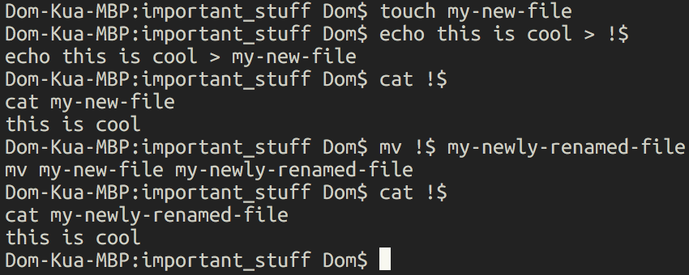

% Technical tips every tester should know
# Technical tips every tester should know

Firstly a word about this blog, its inception and its purpose.

I'm not good at blogging. I've tried it over and over and I've never managed to keep it going for more than a year or 
so. So I had the bright idea of using peer pressure to make me blog more often and so the bloggers club was born. Every 
couple of weeks I'll rely on other people to think of ideas for me to blog about and pressure me to publish. I'm 
basically using tribal instincts as a hack to overcome my laziness, hurrah. 

The topic this week is a technical tip every tester should know. 

Now this is pretty hard because so many technical tips won't be portable. If I throw out Bash tips, windows users will 
be left without something helpful. If I reveal secret web testing techniques then there will be embedded testers 
without something to use and so on. As such I've got to make a choice: Do I write something very general which might 
help many people, or something very specific which helps a smaller subset of people but will actually be useful?

I'm going to cheat. I'll do one sort of general one, and one much more precise one. Hah! Who writes the rules now? 
(It's you Dominic, it was always you and who are you talking to?)

So, on to the tips!

General technical tip: 

Where possible start the system under test from a command line you can read the output from, you'll be amazed at how 
many errors, warnings and other such goodies are thrown into the stdout for programs which are not normally meant to be 
started from the command line. For much of this I'll be using Firefox as my example, because it's open source and well 
documented. Here you can see what's output to the terminal when I run Firefox from the terminal. Now most of these 
errors are not worth bothering about, right until the time when they are and you see the one error which gives you the 
information you need to pinpoint the bug you've been chasing. 

On most systems this is actually fairly easy as installed applications get added to the Path or are installed in a 
location which is already on the Path, Macs are the exception but you can normally find the path to the binary in 
`/Applications` if you've installed it though a dmg.

What will surprise you, possibly, is to learn that many applications have command line options which are completely 
hidden from normal GUI, for example, Firefox can be loaded with different locales specified to normal, which as a 
tester can be incredibly useful. Make a habit of acquainting yourself with the various options of the applications you 
use most often and it'll pay you back in spades. 

Specific technical tip:

If you use a Bash terminal at all, you should look into learning the history expansion commands. 
A Bash terminal is the default command line on most common Linuxes and OSX. There's a raft of "shortcuts"
in Bash that let you do all manner of things by combining an exclamation mark with another character.

We'll start with the extremely excited `!!`. This is immensely useful as it runs the previous command again. Now some of
you might be thinking "But I can just hit up and then enter for that" and you can. But `!!` is much more than that. it
inserts the previous commmand at the point in the new line where you put the double exclamation mark. 

For example:

Bonus tip here, you'll notice I've wrapped the double exclamation mark in back ticks. This inserts the output of the 
enclosed command into the command you're writing. So rather than typing commands, getting the output and then copying 
and pasting, you can embed it directly in your command. Beware though, this could lead to all manner of unintended side 
effects! Be sure you know pretty well what it is that you'll get out of a command before encapsulating it!

Next up is the `!$` command, which inserts the last _argument_ from the previous command, great if you want to do 
multiple operations on a single file, like so:

Finally, if you ever find yourself filling in the same command over and over and `ctrl+r` and searching is too slow, 
you can always just use `!<start of command>` to fill in the command again. 

Enjoy the commmand line!